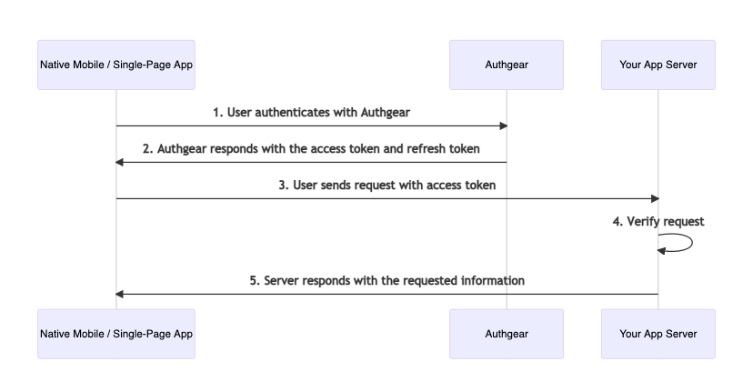

# Token-based \(Native mobile or Single-page app\)

By using Authgear, you can add the login feature to your mobile native app and single-page application easily. Authgear supports various authentication methods, that you can easily turn on and configure in the portal.

## **Overview**

### **How it works**

Your app server will receive a request with the access token



### Verify request in your app server

To verify the request in your app server, you can choose to **Forward authentication to Authgear Resolver Endpoint** or **Verify JSON Web Token \(JWT\) in your app server.**


## Request Example

```bash
> GET /api_path HTTP/1.1
> Host: yourdomain.com
> Authorization: Bearer <AUTHGEAR_ACCESS_TOKEN>
```

## Get Started

The following tutorials show you how to add user login to your native mobile or single-page app using Authgear.

### 1. Frontend Integration

Choose your platform below:









### 2. Backend Integration



