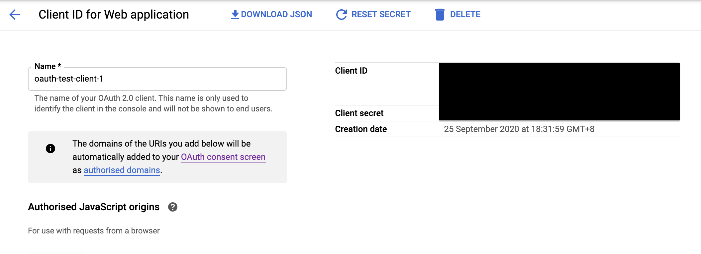

# Google

## Prerequisite

To configure Google OAuth client for Authgear, you will need to create an OAuth client on Google Cloud Platform.

1. Create a project on Google Cloud Platform through [console](https://console.cloud.google.com/)
2. Select APIs & services -&gt; Credentials
3. Click "Create Credentials" and choose OAuth client ID and follow the instructions
4. Add `https://{your domain}/sso/oauth2/callback/{alias}` to "redirect URIs" \(`alias` can be configured in Authgear portal\)
5. After creating a client ID, you will find the client ID in "OAuth 2.0 Client IDs" section in "Credentials" page.

You can find more details in [official Google Cloud Platform doc](https://support.google.com/cloud/answer/6158849)

## Configure Sign in with Google through the portal

After creating an OAuth client, click the name of OAuth client to view the details \(see image below\)

You will need the following fields:

1. "Client ID"
2. "Client secret"

In the portal, go to "Single-Sign On" page, then do the following:

1. Enable "Sign in with Google"
2. Fill in "Alias" with alias used in redirect URI
3. Fill in the client ID field and client secret field
4. Scroll to the bottom and click save

## Notes

* "alias" is used as the identifier of OAuth provider
* Redirect URI has the form "/sso/oauth2/callback/:alias"

