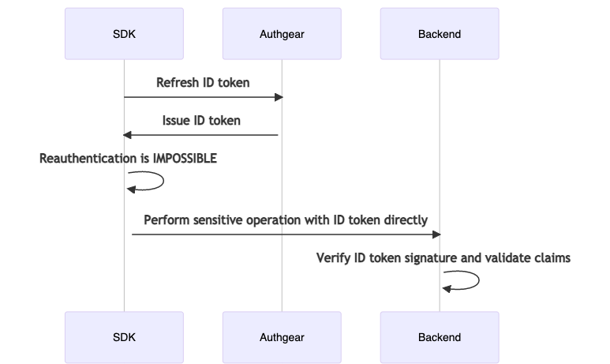
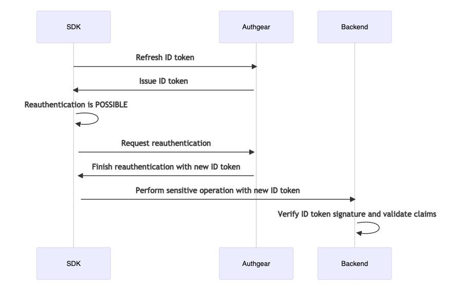

# Reauthentication

## Overview

Reauthentication in Authgear is built on top of the [OIDC ID token](https://openid.net/specs/openid-connect-core-1_0.html#IDToken). The ID token is a JWT.

Your sensitive operation server endpoint **MUST** require the ID token. When you receive the ID token, you **MUST** verify the signature of it. If the signature is valid, you can trust the claims inside the ID token.

The `auth_time` claim in the ID token tells **when** was the end-user last authenticated. You should check the `auth_time` claim to see if the end-user was authenticated recently enough.

The `https://authgear.com/claims/user/can_reauthenticate` claim in the ID token tells whether the end-user can be reauthenticated. If the value of this claim is `false`, then depending on your business needs, you can either allow the end-user to proceed, or forbid the end-user to perform sensitive operations. The flows are illustrated by the following diagrams.





## SDK Integration

The following code snippets illustrate the interaction between the SDK and Authgear.



```typescript
const biometricOptions = {
  ios: {
    localizedReason: 'Use biometric to authenticate',
    constraint: 'biometryCurrentSet' as const,
  },
  android: {
    title: 'Biometric Authentication',
    subtitle: 'Biometric authentication',
    description: 'Use biometric to authenticate',
    negativeButtonText: 'Cancel',
    constraint: ['BIOMETRIC_STRONG' as const],
    invalidatedByBiometricEnrollment: true,
  },
};

async function onClickPerformSensitiveOperation() {
  // Step 1: Refresh the ID token to ensure the claims are up-to-date.
  await authgear.refreshIDToken();

  // Step 2: Check if the end-user can be reauthenticated.
  const canReauthenticate = authgear.canReauthenticate();
  if (!canReauthenticate) {
    // Step 2.1: Depending on your business need, you may want to allow
    // the end-user to proceed.
    // Here we assume you want to proceed.

    const idTokenHint = authgear.getIDTokenHint();

    // Step 2.2: Call the sensitive endpoint with the ID token.
    // It is still required to pass the ID token to the endpoint so that
    // the endpoint can know the end-user CANNOT be reauthenticated.
    return callMySensitiveEndpoint(idTokenHint);
  }

  // Step 3: The end-user can be reauthenticated.
  // If your app supports biometric authentication, you can pass
  // the biometric options to reauthenticate.
  // If biometric is enabled for the current user, it will be used instead.
  await authgear.reauthenticate({
    redirectURI: THE_REDIRECT_URI,
  }, biometricOptions);

  // Step 4: If we reach here, the reauthentication was done.
  // The ID token have up-to-date auth_time claim.
  const idTokenHint = authgear.getIDTokenHint();

  return callMySensitiveEndpoint(idTokenHint);
}
```



```typescript
async function onClickPerformSensitiveOperation() {
  // Step 1: Refresh the ID token to ensure the claims are up-to-date.
  await authgear.refreshIDToken();

  // Step 2: Check if the end-user can be reauthenticated.
  const canReauthenticate = authgear.canReauthenticate();
  if (!canReauthenticate) {
    // Step 2.1: Depending on your business need, you may want to allow
    // the end-user to proceed.
    // Here we assume you want to proceed.

    const idTokenHint = authgear.getIDTokenHint();

    // Step 2.2: Call the sensitive endpoint with the ID token.
    // It is still required to pass the ID token to the endpoint so that
    // the endpoint can know the end-user CANNOT be reauthenticated.
    return callMySensitiveEndpoint(idTokenHint);
  }

  // Step 3: The end-user can be reauthenticated.
  // The end-user will be redirected to Authgear.
  // When the reauthentication finishes,
  // The end-user will be redirected back to the given redirect URI.
  await authgear.startReauthentication({
    redirectURI: THE_REDIRECT_URI
  });
}

// Suppose the following function is run when the end-user is redirected to
// the redirect URI
async function onRedirectAfterReauthentication() {
  // You HAVE to configure authgear again
  // because your website have been visited freshly.
  await authgear.finishReauthentication();
  await authgear.refreshIDToken();
  const idTokenHint = authgear.getIDTokenHint();
  return callMySensitiveEndpoint(idTokenHint);
}
```



```swift
func onClickPerformSensitiveOperation() {
    // Step 1: Refresh the ID token to ensure the claims are up-to-date.
    authgear.refreshIDToken() { result in
        switch result {
        case .success:
            // Step 2: Check if the end-user can be reauthenticated.
            let canReauthenticate = authgear.canReauthenticate
            if !canReauthenticate {
                // Step 2.1: Depending on your business need, you may want to allow
                // the end-user to proceed.
                // Here we assume you want to proceed.
                let idTokenHint = authgear.idTokenHint
                // Step 2.2: Call the sensitive endpoint with the ID token.
                // It is still required to pass the ID token to the endpoint
                // so that the endpoint can know the end-user CANNOT
                // be reauthenticated.
                callMySensitiveEndpoint(idTokenHint)
                return
            }

            // Step 3: The end-user can be reauthenticated.
            // By default biometric is used for reauthentication if it is enabled for the current user.
            // If you do not want biometric to be used, specify skipUsingBiometric: true
            authgear.reauthenticate(redirectURI: THE_REDIRECT_URI, skipUsingBiometric: false) { result in
                switch result {
                case .success:
                    // Step 4: If we reach here, the reauthentication was done.
                    // The ID token have up-to-date auth_time claim.
                    let idTokenHint = authgear.idTokenHint
                    callMySensitiveEndpoint(idTokenHint)
                    return
                case let .failure(error):
                    // Handle the error
                }
            }
        case let .failure(error):
            // Handle the error
        }
    }
}
```



```java
public void onClickPerformSensitiveOperation() {
    BiometricOptions biometricOptions = new BiometricOptions(
        activity, // FragmentActivity
        "Biometric authentication", // title
        "Biometric authentication", // subtitle
        "Use biometric to authenticate", // description
        "Cancel", // negativeButtonText
        ALLOWED, // allowedAuthenticators
        true // invalidatedByBiometricEnrollment
    );

    // Step 1: Refresh the ID token to ensure the claims are up-to-date.
    authgear.refreshIDToken(new OnRefreshIDTokenListener() {
        @Override
        public void onFailed(Throwable throwable) {
            // Handle error
        }
        @Override
        public void onFinished() {
            // Step 2: Check if the end-user can be reauthenticated.
            boolean canReauthenticate = authgear.getCanReauthenticate();
            if (!canReauthenticate) {
                // Step 2.1: Depending on your business need, you may want to allow
                // the end-user to proceed.
                // Here we assume you want to proceed.
                String idTokenHint = authgear.getIDTokenHint();
                // Step 2.2: Call the sensitive endpoint with the ID token.
                // It is still required to pass the ID token to the endpoint
                // so that the endpoint can know the end-user CANNOT
                // be reauthenticated.
                callMySensitiveEndpoint(idTokenHint);
                return;
            }

            // Step 3: The end-user can be reauthenticated.
            // If your app supports biometric authentication, you can pass
            // the biometric options to reauthenticate.
            // If biometric is enabled for the current user, it will be used.
            ReauthenticateOptions options =
                new ReauthenticateOptions(THE_REDIRECT_URI);
            authgear.reauthenticate(options, biometricOptions, new OnReauthenticateListener() {
                @Override
                public void onFailed(Throwable throwable) {
                    // Handle error
                }
                @Override
                public void onFinished(ReauthenticateResult) {
                    // Step 4: If we reach here, the reauthentication was done.
                    // The ID token have up-to-date auth_time claim.
                    String idTokenHint = authgear.getIDTokenHint();
                    callMySensitiveEndpoint(idTokenHint);
                    return;
                }
            });
        }
    });
}
```



### Reauthenticate conditionally by the last authentication time

If the end-users in your application often perform a series of sensitive operation, it is annoying that they have to reauthenticate themselves repeatedly before every operation. To allow the end-users to skip reauthentication if they have just reauthenticated themselves recently, the SDK allows you to inspect the last authentication time of the end-user.



```typescript
async function onClickPerformSensitiveOperation() {
  await authgear.refreshIDToken();
  // Before you trigger reauthentication, check authTime first.
  const authTime = authgear.getAuthTime();
  if (authTime != null) {
    const now = new Date();
    const timeDelta = now.getTime() - authTime.getTime();
    if (timeDelta < 5 * 60 * 1000 /* 5 minutes */) {
      const idTokenHint = authgear.getIDTokenHint();
      return callMySensitiveEndpoint(idTokenHint);
    }
  }

  // Otherwise trigger authentication.
}
```



```swift
func onClickPerformSensitiveOperation() {
    authgear.refreshIDToken() { result in
        switch result {
        case .success:
            // Before you trigger reauthentication, check authTime first.
            if let authTime = authgear.authTime {
                let now = Date()
                let timeDelta = now.timeIntervalSince(authTime)
                if timeDelta < 5 * 60 {
                    let idTokenHint = authgear.idTokenHint
                    callMySensitiveEndpoint(idTokenHint)
                    return
                }
            }
            // Otherwise trigger authentication.
        case let .failure(error):
            // Handle the error
        }
    }
}
```



```java
public void onClickPerformSensitiveOperation() {
    authgear.refreshIDToken(new OnRefreshIDTokenListener() {
        @Override
        public void onFailed(Throwable throwable) {
            // Handle error
        }
        @Override
        public void onFinished() {
            // Before you trigger reauthentication, check authTime first.
            Date authTime = authgear.getAuthTime();
            if (authTime != null) {
                Date now = new Date();
                long timedelta = now.getTime() - authTime.getTime();
                if (timedelta < 5 * 60 * 1000) {
                    String idTokenHint = authgear.getIDTokenHint();
                    callMySensitiveEndpoint(idTokenHint);
                    return;
                }
            }
            // Otherwise trigger authentication.
        }
    });
}
```



## Backend Integration

Finally in your backend, you have to verify the signature of the ID token, and then validate the claims inside.



```python
import json
from contextlib import closing
from urllib.request import urlopen
from datetime import datetime, timezone, timedelta

import jwt
from jwt import PyJWKClient

base_address = "https://<your_app_endpoint>"

def fetch_jwks_uri(base_address):
    doc_url = base_address + "/.well-known/openid-configuration"
    with closing(urlopen(doc_url)) as f:
        doc = json.load(f)
    jwks_uri = doc["jwks_uri"]
    if not jwks_uri:
        raise Exception('Failed to fetch jwks uri.')
    return jwks_uri

def my_endpoint():
    id_token = GET_ID_TOKEN_FROM_HTTP_REQUEST_SOMEHOW()
    try:
        jwks_uri = fetch_jwks_uri(base_address)
        # Reuse PyJWKClient for better performance
        jwks_client = PyJWKClient(jwks_uri)
        signing_key = jwks_client.get_signing_key_from_jwt(id_token)
        claims = jwt.decode(
            id_token,
            signing_key.key,
            algorithms=["RS256"],
            audience=base_address,
            options={"verify_exp": True},
        )
        auth_time = claims["auth_time"]
        dt = datetime.fromtimestamp(auth_time)
        now = datetime.utcnow()
        delta = now - dt
        if delta > timedelta(minutes=5):
            raise ValueError("auth_time is not recent enough")
    except:
        # Handle error
        raise
```



```go
package main

import (
    "context"
    "encoding/json"
    "fmt"
    "net/http"
    "time"

    "github.com/lestrrat-go/jwx/jwk"
    "github.com/lestrrat-go/jwx/jwt"
)

var (
    baseAddress = "https://<your_app_endpoint>"
)

type OIDCDiscoveryDocument struct {
    JWKSURI string `json:"jwks_uri"`
}

func FetchOIDCDiscoveryDocument(endpoint string) (*OIDCDiscoveryDocument, error) {
    resp, err := http.DefaultClient.Get(endpoint)
    if err != nil {
        return nil, err
    }
    defer resp.Body.Close()

    if resp.StatusCode != http.StatusOK {
        return nil, fmt.Errorf(
            "failed to fetch discovery document: unexpected status code: %d",
            resp.StatusCode,
        )
    }

    var document OIDCDiscoveryDocument
    err = json.NewDecoder(resp.Body).Decode(&document)
    if err != nil {
        return nil, err
    }
    return &document, nil
}

func FetchJWK(baseAddress string) (jwk.Set, error) {
    doc, err := FetchOIDCDiscoveryDocument(
        baseAddress + "/.well-known/openid-configuration",
    )
    if err != nil {
        return nil, err
    }

    set, err := jwk.Fetch(context.Background(), doc.JWKSURI)
    return set, err
}

func CheckIDToken(idToken string) error {
    // fetch jwks_uri from Authgear
    // you can cache the value of jwks to have better performance
    set, err := FetchJWK(baseAddress)
    if err != nil {
        return fmt.Errorf("failed to fetch JWK: %s", err)
    }

    // parse jwt token
    token, err := jwt.ParseString(idToken, jwt.WithKeySet(set))
    if err != nil {
        return fmt.Errorf("invalid token: %s", err)
    }

    // validate jwt token
    err = jwt.Validate(token,
        jwt.WithClock(jwt.ClockFunc(
            func() time.Time { return time.Now().UTC() },
        )),
        jwt.WithIssuer(baseAddress),
    )
    if err != nil {
        return fmt.Errorf("invalid token: %s", err)
    }

    authTimeAny, ok := token.Get("auth_time")
    if !ok {
        return fmt.Errorf("no auth_time")
    }

    authTimeUnix, ok := authTimeAny.(float64)
    if !ok {
        return fmt.Errorf("auth_time is not number")
    }

    authTime := time.Unix(int64(authTimeUnix), 0)
    now := time.Now().UTC()

    diff := now.Sub(authTime)
    if diff > 5*time.Minute {
        return fmt.Errorf("auth_time is not recent enough")
    }

    return nil
}
```



