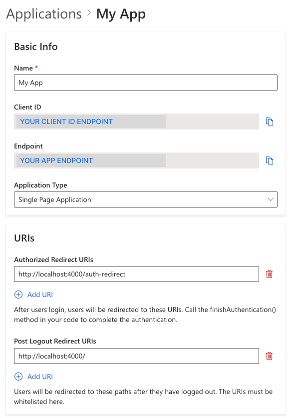
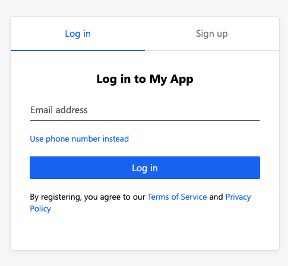
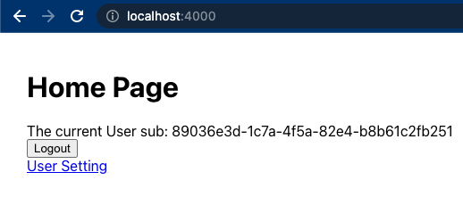

# React Tutorial: User Auth with Authgear SDK

Authgear helps you add user logins to your React apps. It provides prebuilt login page and user settings page that accelerate the development.

Follow this :clock1: **15 minutes** tutorial to create a simple app using React with Authgear SDK.


**Check out and clone** [<mark style="color:orange;">**the Sample Project on GitHub**</mark>](https://github.com/authgear/authgear-example-react)**.**


**Table of Content**

* [Setup Application in Authgear](react.md#setup-application-in-authgear)
* [Create a simple React project](react.md#step-1-create-a-simple-react-project)
* [Install Authgear SDK to the project](react.md#step-2-install-authgear-sdk-to-the-project)
* [Implement Context Provider](react.md#step-3-implement-the-context-provider)
* [Implement the Auth Redirect page](react.md#step-4-implement-the-auth-redirect)
* [Add a Login button](react.md#step-6-add-a-login-button)
* [Show the user information](react.md#step-7-show-the-user-information)
* [Add a Logout button](react.md#step-8-add-an-logout-button)
* [Open User Settings](react.md#step-9-open-user-settings)
* [Calling an API](react.md#finally-calling-an-api)

## Setup Application in Authgear

Signup for an account in [https://portal.authgearapps.com/](https://portal.authgearapps.com/) and create a Project.

After that, we will need to create an Application in the Project Portal.

### Create an application in the Portal

1. Go to **Applications** on the left menu bar.
2. Click **⊕Add Application** in the top tool bar.
3. Input the name of your application, e.g. "MyAwesomeApp".
4. Select **Single Page Application** as the application type&#x20;
5. Click "Save" to create the application

### Configure Authorize Redirect URI

The Redirect URI is a URL in you application where the user will be redirected to after login with Authgear. In this path, make a **finish authentication** call to complete the login process.&#x20;

For this tutorial, add `http://localhost:4000/auth-redirect` to Authorize Redirect URIs.

### Configure Post Logout Redirect URI

The Post Logout Redirect URI is the URL users will be redirected after they have logged out. The URL must be whitelisted.

For this tutorial, add `http://localhost:4000/` to Post Logout Redirect URIs.

**Save** the configuration before next steps.



## Step 1: Create a simple React project

Here are some recommended steps to scaffold a React project. You can skip this part if you are adding Authgear to an existing project. See [#install-authgear-sdk-to-the-project](react.md#install-authgear-sdk-to-the-project "mention") in the next section.

#### Install basic project dependencies

Create the project folder and install the dependencies. We will use `parcel` as the build tool and the `react-router-dom`, `react` , and `react-dom` packages. Also, we will use TypeScript in this tutorial.&#x20;

```bash
# Create a new folder for your project
mkdir my-app
# Move into the project directory
cd my-app
# Create source folder
mkdir src
# Create a brand new package.json file
npm init -y
# Install parcel
npm install --save-dev --save-exact parcel
# Install react, react-dom and react router
npm install --save-exact react react-dom react-router-dom
# Install TypeScript and related types
npm install --save-dev --save-exact typescript @types/react @types/react-dom @types/react-router-dom
```

#### Add script for launching the app

In the `package.json` file, add these two lines to the `script` section

```bash
"start": "parcel serve --port 4000 --no-cache ./src/index.html",
"build": "parcel build --no-cache ./src/index.html"
```

The `start` script run the app in development mode on port 4000. The `build` script build the app for production to the `dist/` folder.

#### Create the `index.html` file

In `src/`, create a new file called `index.html` for parcel to bundle the app:&#x20;

`src/index.html`:

```html
<!DOCTYPE html>
<html lang="en">
  <head>
    <meta charset="utf-8" />
    <meta name="viewport" content="width=device-width, initial-scale=1" />
    <title>Authgear React Tutorial Demo App</title>
  </head>
  <body>
    <div id="react-app-root"></div>
    <script type="module" src="./index.tsx"></script>
  </body>
</html>

```

#### Create the `App.tsx` file

Create a new file called `App.tsx` with simply showing `Hello World` in the screen:&#x20;

```javascript
// src/App.tsx
import React from "react";

const App: React.FC = () => {
  return <div>Hello World</div>;
};

export default App;

```

#### Create the `index.tsx` file

Create a new file called `index.tsx` as the entry point of the application.

```tsx
// src/index.tsx
import React from "react";
import { createRoot } from "react-dom/client";
import App from "./App";

async function init() {
  try {
   // initialization code
  } finally {
    createRoot(document.getElementById("react-app-root")!).render(<App />);
  }
}

init().catch((e) => {
  // Error handling
  console.error(e)
});
 
```

The file structure in your project is now:

```bash
my-app
├── node_modules
│   └── (...)
├── package-lock.json
├── package.json
└── src
    ├── App.tsx
    ├── index.html
    └── index.tsx
```

Run `npm start` now to run the project and you will see "Hello World" on `http://localhost:4000`.

## Step 2: Install Authgear SDK to the project

Run the following command within your React project directory to install the Authgear Web SDK

```bash
npm install --save --save-exact @authgear/web
```

In `src/index.tsx` , import `authgear` and call the `configure` function to initialize an Authgear instance on application loads.

```tsx
// src/index.tsx
import React from "react";
import { createRoot } from "react-dom/client";
import App from "./App";
import authgear from "@authgear/web";

async function init() {
  try {
    // configure Authgear container instance
    await authgear.configure({
      endpoint: "<your_app_endpoint>",
      clientID: "<your_client_id>",
      sessionType: "refresh_token",
    });
  } finally {
    createRoot(document.getElementById("react-app-root")!).render(<App />);
  }
}

init().catch((e) => {
  // Error handling
  console.error(e)
});
```

The Authgear container instance takes `endpoint` and `clientID` as parameters. They can be obtained from the application page created in [#setup-application-in-authgear](react.md#setup-application-in-authgear "mention").

It is recommend to render the app after `configure()` resolves. So by the time the app is rendered, Authgear is ready to use.&#x20;


Run ** `npm start` ** now and you should see a page with "Hello World" and no error message in the console if Authgear SDK is configured successfully


## Step 3: Implement the Context Provider

Since we want to reference the logged in state in anywhere of the app, let's put the state in a **context provider** with `UserProvider.tsx` in the `/src/context` folder.&#x20;

In `UserProvider.tsx`, it will have a `isLoggedIn` boolean and a `setIsLoggedIn` function. The is `LoggedIn` boolean state can be auto updated using the `onSessionStateChange` callback. This callback can be stored in `delegate` which is in the local SDK container.&#x20;

```tsx
// src/context/UserProvider.tsx
import React, { createContext, useEffect, useState, useMemo } from "react";
import authgear from "@authgear/web";

interface UserContextValue {
  isLoggedIn: boolean;
}

export const UserContext = createContext<UserContextValue>({
  isLoggedIn: false,
});

interface UserContextProviderProps {
  children: React.ReactNode;
}

const UserContextProvider: React.FC<UserContextProviderProps> = ({
  children,
}) => {
  // By default the user is not logged in
  const [isLoggedIn, setIsLoggedIn] = useState<boolean>(false);

  useEffect(() => {
    // When the sessionState changed, logged in state will also be changed
    authgear.delegate = {
      onSessionStateChange: (container) => {
        // sessionState is now up to date
        // Value of sessionState can be "NO_SESSION" or "AUTHENTICATED"
        const sessionState = container.sessionState;
        if (sessionState === "AUTHENTICATED") {
          setIsLoggedIn(true);
        } else {
          setIsLoggedIn(false);
        }
      },
    };
  }, [setIsLoggedIn]);

  const contextValue = useMemo<UserContextValue>(() => {
    return {
      isLoggedIn,
    };
  }, [isLoggedIn]);

  return (
    <UserContext.Provider value={contextValue}>{children}</UserContext.Provider>
  );
};

export default UserContextProvider;

```

## Step 4: Implement the Auth Redirect

Next, we will add an "AuthRedirect" page for handling the authentication result after the user have been authenticated by Authgear.

Create the `AuthRedirect.tsx` component file in the `src/` folder.&#x20;

Call the Authgear `finishAuthentication()` function in the Auth Redirect component to send a token back to Authgear server in exchange for access token and refresh token. Don't worry about the technical jargons, `finishAuthentication()` will do all the hard work for you and and save the authentication data.

When the authentication is finished, the `isLoggedIn` state from the UserContextProvider will automatic set to `true`.  Finally, navigate back to root (`/`) which is our Home page.

The final `AuthRedirect.tsx` will look like this

```tsx
// src/AuthRedirect.tsx
import React, { useEffect, useRef } from "react";
import { useNavigate } from "react-router-dom";
import authgear from "@authgear/web";

const AuthRedirect: React.FC = () => {
  const usedToken = useRef(false);

  const navigate = useNavigate();

  useEffect(() => {
    async function updateToken() {
      try {
        await authgear.finishAuthentication();
      } finally {
        navigate("/");
        usedToken.current = true;
      }
    }

    if (!usedToken.current) {
      updateToken().catch((e) => console.error(e));
    }
  }, [navigate]);

  return <></>;
};

export default AuthRedirect;

```


Since in React 18, useEffect will be fired twice in development mode, we need to implement a [cleanup function](https://beta.reactjs.org/learn/synchronizing-with-effects#how-to-handle-the-effect-firing-twice-in-development) to stop it from firing twice. We will use an `useRef` Hook to stop the user token from being sent twice to the Authgear Endpoint.

Without a cleanup function, an`useEffect`Hook will be fired twice and hence `finishAuthentication() will` send the token back to Authgear Endpoint for two times, which the second one will result in "Invalid Token" error since the token can only be used once.


## Step 5: Add Routes and Context Provider to the App

Next, we will add a "Home" page . Create a `Home.tsx` component file the `src/` folder.&#x20;

Then import **Home** and **AuthRedirect** as routes. And Import **UserContextProvider** and wrap the routes with it.

Your final `App.tsx` should look like this:

<pre class="language-tsx"><code class="lang-tsx">// src/App.tsx
import React from "react";
import { BrowserRouter as Router, Routes, Route } from 'react-router-dom';
import Home from './Home';
import AuthRedirect from './AuthRedirect';
import UserContextProvider from './context/UserProvider';

const App: React.FC = () => {
  return (
    &#x3C;UserContextProvider>
      &#x3C;Router>
<strong>        &#x3C;Routes>
</strong>          &#x3C;Route path="/auth-redirect" element={&#x3C;AuthRedirect />} />
          &#x3C;Route path="/" element={&#x3C;Home />} />
        &#x3C;/Routes>
      &#x3C;/Router>
    &#x3C;/UserContextProvider>
  );
}

export default App;
</code></pre>

The file structure should now look like

```
src
├── App.tsx
├── AuthRedirect.tsx
├── Home.tsx
├── context
│   └── UserProvider.tsx
├── index.html
└── index.tsx
```

## Step 6: Add a Login button

First we will import the Authgear dependency and the React Hook that we will use to `Home.tsx`. Then add the login button which will call `startAuthentication(ConfigureOptions)` through `startLogin` callback on click. This will redirect the user to the login page.

```tsx
// src/Home.tsx
import React, { useEffect, useState, useCallback, useContext } from 'react';
import authgear from '@authgear/web';

const Home: React.FC = () => {
  const startLogin = useCallback(() => {
    authgear
      .startAuthentication({
        redirectURI: 'http://localhost:4000/auth-redirect',
        prompt: 'login'
      })
      .then(
        () => {
          // started authentication, user should be redirected to Authgear
        },
        err => {
          // failed to start authentication
        }
      );
  }, []);
  return (
    <div>
      <h1>Home Page</h1>
      <div>
        <button onClick={startLogin}>Login</button>
      </div>
    </div>
  );
}

export default Home;

```

You can now run **`npm start`** and you will be redirected to the Authgear Login page when you click the Login button.



## Step 7: Show the user information

The Authgear SDK helps you get the information of the logged in users easily.

In the last step, the user is successfully logged in so let's try to print the user ID (sub) of the user in the Home page.

In `Home.tsx`, we will add a simple Loading splash and a greeting message printing the Sub ID. We will add two conditional elements such that they are only shown when user is logged in. We can also change the login button to show only if the user is not logged in.&#x20;

Make use of `isLoggedIn` from the `UserContext` to control the components on the page. Fetch the user info by `fetchInfo()` and access its `sub` property.

```tsx
// src/Home.tsx  
import React, { useEffect, useState, useCallback, useContext } from "react";
import authgear from "@authgear/web";
import { UserContext } from "./context/UserProvider";

const Home: React.FC = () => {
  const [greetingMessage, setGreetingMessage] = useState<string>("");
  const [isLoading, setIsLoading] = useState<boolean>(false);
  const { isLoggedIn } = useContext(UserContext);

  useEffect(() => {
    async function updateGreetingMessage() {
      setIsLoading(true);
      try {
        if (isLoggedIn) {
          const userInfo = await authgear.fetchUserInfo();
          setGreetingMessage("The current User sub: " + userInfo.sub);
        }
      } finally {
        setIsLoading(false);
      }
    }

    updateGreetingMessage().catch((e) => {
      console.error(e);
    });
  }, [isLoggedIn]);

  const startLogin = useCallback(() => {
    authgear
      .startAuthentication({
        redirectURI: "http://localhost:4000/auth-redirect",
        prompt: "login",
      })
      .then(
        () => {
          // started authentication, user should be redirected to Authgear
        },
        (err) => {
          // failed to start authentication
        }
      );
  }, []);

  return (
    <div>
      <h1>Home Page</h1>
      {isLoading && "Loading"}
      {greetingMessage ? <span>{greetingMessage}</span> : null}
      {!isLoggedIn && (
        <div>
          <button type="button" onClick={startLogin}>
            Login
          </button>
        </div>
      )}
    </div>
  );
};

export default Home;
```

Run the app again, the User ID (sub) of the user should be printed on the Home page.

## Step 8: Add a Logout button

Finally, let's add an Logout button when user is logged in.&#x20;

In `Home.tsx`, we will add a conditional elements in the elements:

```tsx
{isLoggedIn && (
  <div>
    <button onClick={logout}>Logout</button>
  </div>
)}
```

And add the `logout` callback:

```tsx
const logout = useCallback(() => {
  authgear
    .logout({
      redirectURI: "http://localhost:4000/",
    })
    .then(
      () => {
        setGreetingMessage('');
      },
      (err) => {
        console.error(err);
      }
  );
}, []);
```

Run the app again, we can now logout by clicking the logout button.

## Step 9: Open User Settings

Authgear provide a built-in UI for the users to set their attributes and change security settings.&#x20;

Use the `openURL` function to open the setting page at `<your_app_endpoint>/settings`

In `Home.tsx` Add a conditional link to the elements.

```tsx
{isLoggedIn && (
  <a target="_blank" rel="noreferrer" onClick={userSetting} href="#">
    User Setting
  </a>
)}
```

And add the `userSetting` callback:

```tsx
import authgear, { Page } from "@authgear/web";
const userSetting = useCallback((e: React.MouseEvent<HTMLAnchorElement>) => {
    e.preventDefault();
    e.stopPropagation();
    authgear.open(Page.Settings);
}, []);
```

This the the resulting `Home.tsx`:

```tsx
// src/Home.tsx
import React, { useEffect, useState, useCallback, useContext } from "react";
import { UserContext } from "./context/UserProvider";
import authgear, { Page } from "@authgear/web";

const Home: React.FC = () => {
  const [greetingMessage, setGreetingMessage] = useState<string>("");
  const [isLoading, setIsLoading] = useState<boolean>(false);
  const { isLoggedIn } = useContext(UserContext);

  useEffect(() => {
    async function updateGreetingMessage() {
      setIsLoading(true);
      try {
        if (isLoggedIn) {
          const userInfo = await authgear.fetchUserInfo();
          setGreetingMessage("The current User sub: " + userInfo.sub);
        }
      } finally {
        setIsLoading(false);
      }
    }

    updateGreetingMessage().catch((e) => {
      console.error(e);
    });
  }, [isLoggedIn]);

  const startLogin = useCallback(() => {
    authgear
      .startAuthentication({
        redirectURI: "http://localhost:4000/auth-redirect",
        prompt: "login",
      })
      .then(
        () => {
          // started authorization, user should be redirected to Authgear
        },
        (err) => {
          // failed to start authorization
          console.error(err);
        }
      );
  }, []);

  const logout = useCallback(() => {
    authgear
      .logout({
        redirectURI: "http://localhost:4000/",
      })
      .then(
        () => {
          setGreetingMessage("");
        },
        (err) => {
          console.error(err);
        }
      );
  }, []);

  const userSetting = useCallback((e: React.MouseEvent<HTMLAnchorElement>) => {
    e.preventDefault();
    e.stopPropagation();
    authgear.open(Page.Settings);
  }, []);

  return (
    <div>
      {/* eslint-disable-next-line react/forbid-elements */}
      <h1>Home Page</h1>
      {isLoading && "Loading"}
      {greetingMessage ? <span>{greetingMessage}</span> : null}
      {!isLoggedIn && (
        <div>
          <button type="button" onClick={startLogin}>
            Login
          </button>
        </div>
      )}
      {isLoggedIn && (
        <div>
          <button type="button" onClick={logout}>
            Logout
          </button>
          <br />
          <a target="_blank" rel="noreferrer" onClick={userSetting} href="#">
            User Setting
          </a>
        </div>
      )}
    </div>
  );
};

export default Home;
```



## Next steps, Calling an API

To access restricted resources on your backend application server, the HTTP requests should include the access token in their Authorization headers. The Web SDK provides a `fetch` function which automatically handle this, or you can get the token with `authgear.accessToken`.

#### Option 1: Using fetch function provided by Authgear SDK

Authgear SDK provides the `fetch` function for you to call your application server. This `fetch` function will include the Authorization header in your application request, and handle refresh access token automatically. The `authgear.fetch` implements [fetch](https://fetch.spec.whatwg.org/).

```javascript
authgear
    .fetch("YOUR_SERVER_URL")
    .then(response => response.json())
    .then(data => console.log(data));
```

#### Option 2: Add the access token to the HTTP request header

You can get the access token through `authgear.accessToken`. Call `refreshAccessTokenIfNeeded` every time before using the access token, the function will check and make the network call only if the access token has expired. Include the access token into the Authorization header of the application request.

```javascript
authgear
    .refreshAccessTokenIfNeeded()
    .then(() => {
        // access token is ready to use
        // accessToken can be string or undefined
        // it will be empty if user is not logged in or session is invalid
        const accessToken = authgear.accessToken;

        // include Authorization header in your application request
        const headers = {
            Authorization: `Bearer ${accessToken}`
        };
    });
```
